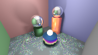

## Raytracer – computer graphics course final project (2016 spring)

Open the `raytracer.sln` file with an up to date version of Microsoft Visual Studio (with C++) and build and run.  
The default demo settings will give you this render:

> 

in a file `view1.bmp` in the executing directory. If you want the full HD render at the top, change the settings in `the_scene.cpp` to
```
TheScene::TheScene() :
screen_width(1920),
screen_height(1080),
fov(75),
aa_pixel(4), // points per side on pixel to sample for anti aliasing
ray_hp(17) // ray "hit points", i.e. recursion depth control
```
Beware it will take many hours if you do this. A line will be printed on the console for every one in a few horizontal single pixel lines that have completed rendering.

### Functionality
- draws flat surfaces and cylinders
- mirror and glossy reflection
- area and volume light sources
- texture mapping
  (demo is procedural, but the code easily generalizes to texture)
  
### Source code structure

`raytracer.h/cpp`  
Contains the main raytracing loop. Controls the originating rendering logic.

`material.h/cpp`  
Has various classes describing how to shade different materials.
Since raytracing shading techniques involve sending more rays,
some of that ray tracing logic can be found in the appropriate
shaders. These files deal with a lot and basically is the biggest
origin of calls to other modules. It needs to call object
intersection to test shadows. It takes care of all the shading
because OO programming design worked out best for having
different types of materials to be shaded.

`light_source.h/cpp`  
Light sources follow a simple
rule: every intersection wanting to be shaded will call on light
sources to sample light points on which to do single point Phong
shading with. This model easily captures most lights this current
raytracing framework might want to render.

`sampler.h/cpp`  
This module came very late but became very handy in generating
values for distributed ray tracing. It has an interface like
OpenGL's where you first call the begin function and then call
the sampling function a bunch of times any time you need it
and the class remembers what you need from it each next time.
The sampling for each set is meant to approximate a uniform
distribution over the Euclidean measure as efficiently as possible.

`scene_object.h/cpp`  
The object intersection stuff. Fairly straightforward calculation
logic. To optimize speed, I arranged some geometry calculations
in the code to minimize unnecessary work.

`the_scene.h/cpp`  
The place where the scene is set up. Not really super proper code,
but in lieu of an actual UI this "programming interface" is good
enough to get things working fairly easily.

`util.h/cpp`  
Ah yes, the utility file, where everyone puts stuff that don't
quite deserve their own file. I realized how primitive the vector
stuff of the starter code was, so I made every kind of small data
into POD types. I only really did that when I saw how much time
matrix multiplication took before removing the tree traversal
per pixel, but actually I realize we don't really multiply matrices
all that much and operations on these data structures here are
too simple to see any speed up by changing them into PODs. Also
on a second profiling session I saw normalizing vectors took a
good amount of time. So I wrote some derived matrix class which
represent similarity matrices, which scale vectors in every
direction the same amount. In other words, its scaling of normalized
vectors can be precomputed. But what I didn't know at the time was
that to make this polymorphism work I had to store these matrices
in pointers. So I didn't actually want to spend time making all
these changes, but the new class is already there.
